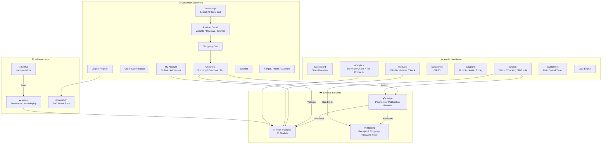
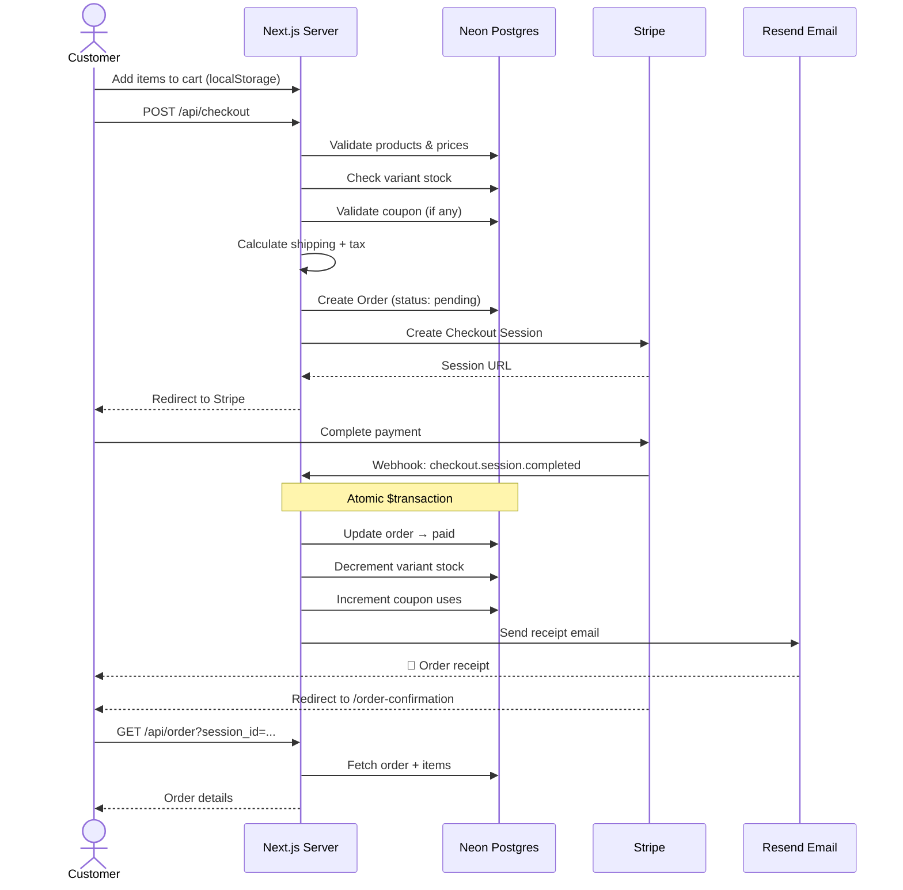
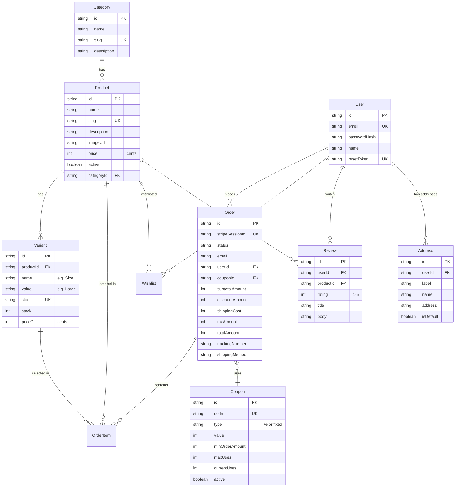
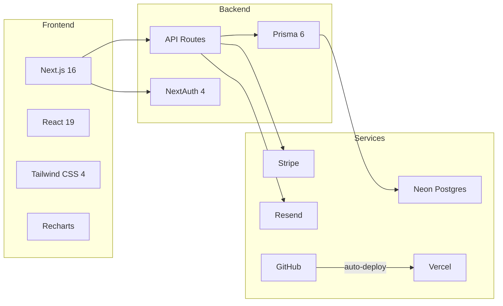

# CF Store — Visual Architecture

## System Overview



## Purchase Flow



## Order Fulfillment Flow

```mermaid
sequenceDiagram
    actor A as Admin
    participant S as Next.js Server
    participant DB as Neon Postgres
    participant ST as Stripe
    participant E as Resend Email

    A->>S: Update status → Processing
    S->>DB: Update order status

    A->>S: Update status → Shipped + Tracking #
    S->>DB: Update order + shippedAt
    S->>E: Send shipping notification
    E-->>Note: 📧 "Your order shipped!" + tracking

    Note over A,S: If refund needed:
    A->>S: POST /api/admin/orders/[id]/refund
    S->>ST: Create refund
    ST-->>S: Refund confirmed
    S->>DB: Update status → refunded
```

## Database Schema



## Tech Stack


